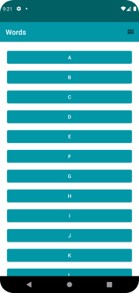
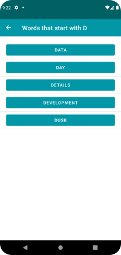
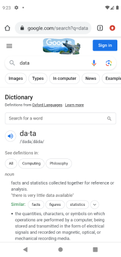

# Words App

This folder contains the source code for the Words app codelab.

# Introduction
Words app allows you to select a letter and use Navigation Component to navigate to a Fragment that
presents a number of words starting with that letter. The navigation is hosted in a single activity
with separate fragment for each screen. 
Each word can be looked up via a web search.

Words app contains a scrollable list of 26 letters A to Z in a RecyclerView. The orientation
of the RecyclerView can be changed between a vertical list or a grid of items.

The Fragments are embedded in a FragmentContainerView in a single activity.

The app demonstrates the use of Fragments.

